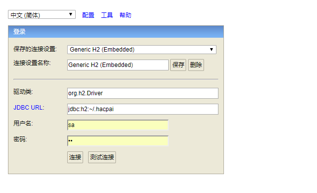
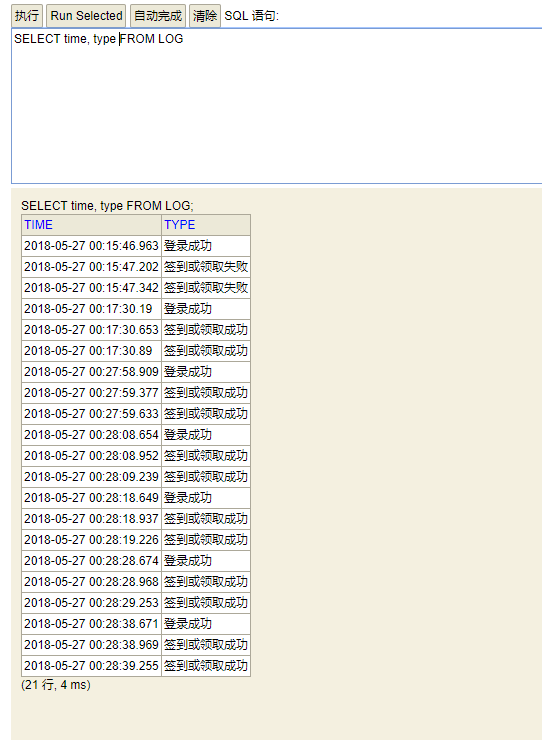

# 黑客派自动签到

不会保存密码，每天8点多定时登录，同时领取昨日的丰厚奖励！ 最后记录一点点日志，让你能够查看过去发生过什么。

# 如何启动
#### 1. 准备
- JDK 1.8环境
- 你的用户名和密码

#### 2. 编译打包
- windows 环境下： `gradlew.bat build`
- linux 环境下： `./gradlew build`

#### 3. 运行

运行编译好的jar包（./build/libs/目录下），同时附上你的用户名密码

- 非后台运行 `java -jar build\libs\sign-0.0.1.jar --userName=你的用户名 --userPassword=你的密码`
- linux下的后台运行 `nohup java -jar build\libs\sign-0.0.1.jar --userName=你的用户名 --userPassword=你的密码  &`

看到日志表示运行成功，注意查看日志有误报错代码。

```

  .   ____          _            __ _ _
 /\\ / ___'_ __ _ _(_)_ __  __ _ \ \ \ \
( ( )\___ | '_ | '_| | '_ \/ _` | \ \ \ \
 \\/  ___)| |_)| | | | | || (_| |  ) ) ) )
  '  |____| .__|_| |_|_| |_\__, | / / / /
 =========|_|==============|___/=/_/_/_/
 :: Spring Boot ::        (v2.0.2.RELEASE)
...
...
...
...
...
2018-05-27 00:43:58.607  INFO 25372 --- [main] o.s.b.w.embedded.tomcat.TomcatWebServer  : Tomcat started on port(s): 8089 (http) with context path ''
2018-05-27 00:43:58.611  INFO 25372 --- [  main] c.xjtushilei.quartz4hacpai.Application   : Started Application in 5.008 seconds (JVM running for 5.463)
```
# 如何查看日志

浏览器访问`http://localhost:8089/h2`, JDBC URL:`jdbc:h2:~/.hacpai`


即可查看日志，`用户名` / `密码`: `sa` / `sa`




